# 关于移动端vh、vw、vmin、vmax在不同浏览器下的调研

首先，为什么需要对它们进行调研呢？因为在移动端不同的浏览器下，各种css属性不一定都能展示，而即使能展示，也不一定是相同的效果。
为什么在不同的浏览器下兼容性不同呢？因为各种浏览器有不同的浏览器内核。

**浏览器内核**

浏览器内核也可以称为渲染引擎(Rendering Engine),排版引擎,解释引擎,它负责对网页的语法的解释（比如HTML,JavaScript）并渲染（显示）网页。渲染引擎决定了浏览器如何显示网页的内容以及网页的格式信息。不同的浏览器内核对网页编写语法的解释也有不同，因此同一网页在不同内核的浏览器里的渲染效果也可能不同。
至于内核是如何渲染的，本文不详细展开,详情请戳[渲染引擎](https://www.zybuluo.com/yangfch3/note/671516)

### 一、分类

目前移动设备浏览器上常用的内核有 Webkit，Blink，Trident，Gecko 等，其中 iPhone 和 iPad 等苹果 iOS 平台主要是 WebKit，Android 4.4 之前的 Android 系统浏览器内核是 WebKit，Android4.4 系统浏览器切换到了Chromium，内核是 Webkit 的分支 Blink，Windows Phone 8 系统浏览器内核是 Trident。

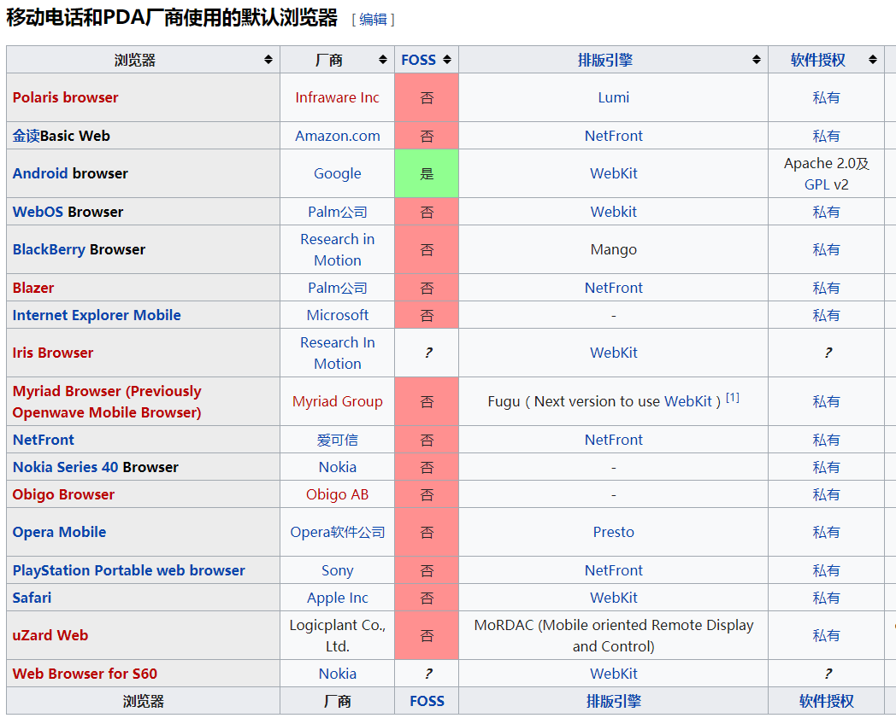
以下有一些比较常用的移动端浏览器

- QQ浏览器-(X5内核)
- Safari(Webkit内核)
- UC浏览器(U3内核-由webkit发展而来)
- 百度浏览器(Blink/Trident双内核)
- 魅族内置浏览器(WebKit内核)
- Chrome浏览器(WebKit内核)

可以看出移动端除了 Android 上腾讯家的 X5 内核，基本上全部是 Webkit 内核或 Blink 内核
### 二、四大浏览器内核的简单介绍

1. Trident

IE浏览器使用的内核,缺陷：一是Trident内核曾经几乎与W3C标准脱节（2005年），二是Trident内核的大量 Bug等安全性问题没有得到及时解决。

2. Gecko

Netscape6开始采用的内核，后来的Mozilla FireFox (火狐浏览器) 也采用了该内核，Gecko的特点是代码完全公开，因此，其可开发程度很高，全世界的程序员都可以为其编写代码，增加功能。

3. Presto

目前Opera采用的内核，该内核在2003年的Opera7中首次被使用，该款引擎的特点就是渲染速度的优化达到了极致，也是目前公认网页浏览速度最快的浏览器内核，然而代价是牺牲了网页的兼容性。实际上这是一个动态内核，与前面几个内核的最大的区别就在脚本处理上，Presto有着天生的优势，页面的全部或者部分都能够在回应脚本事件时等情况下被重新解析。只是Presto是商业引擎。

4. Webkit

苹果公司的内核，也是苹果的Safari浏览器使用的内核。Webkit也是自由软件，同时开放源代码。

详情请戳[浏览器内核](https://baike.baidu.com/item/%E6%B5%8F%E8%A7%88%E5%99%A8%E5%86%85%E6%A0%B8)

### 三、浏览器中的单核与双核
 浏览器双核是指有两套软件用来展示网页（即渲染引擎），如果一个引擎展示某个网站失败，就会自动换用引擎，保证网页完美显示。由于IE浏览器在国内的普及率非常高，所以造成了很多网上银行和支付系统只支持IE的Trident内核，其他浏览器访问根本无法进行正常支付和转账等业务。而WebKit内核的非IE浏览器以更高的性能和更好的用户体验拥有了越来越多的用户。于是双核浏览器应运而生，在不用网上交易的一般网站，使用速度快的WebKit内核访问，这就是所谓的“高速模式”；在访问支付宝或者网上银行的时候，使用Trident内核的“兼容模式”来进行业务。

目前主要双核浏览器(通常是Trident和Webkit)有：

360安全浏览器
猎豹浏览器
搜狗浏览器
QQ浏览器
傲游浏览器（3.0）

### 四、CSS3中与长宽有关的某些属性

 - rem：相对于根元素的字体大小的单位
 - em：相对于父元素的字体大小的单位
 - %：定义基于包含块（父元素）的百分比宽度
 - vh：1vh等于视窗(viewport，也可以叫做视区、视界或可视范围)高度的1%
 - vw：1vw等于视窗(viewport，也可以叫做视区、视界或可视范围)宽度的1%
 - vmax：vh，vw中最大值
 - vmin：vh，vw中最小值

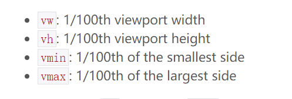

**“视区”所指为浏览器内部的可视区域大小，即window.innerWidth/window.innerHeight大小，包含滚动条宽度，不包含任务栏标题栏以及底部工具栏的浏览器区域大小。**

### 五、支持各种长度相关属性的浏览器版本

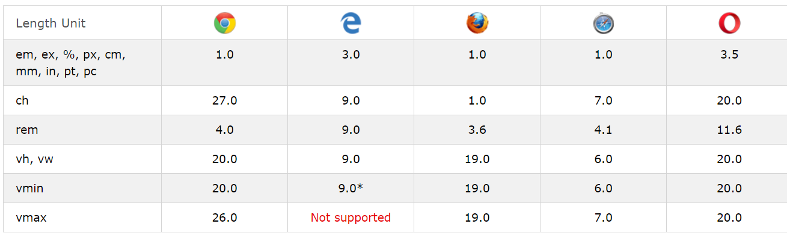

如果你想知道得更多更详细的兼容，请戳这里[caniuse](https://caniuse.com/#search=vh)

对于移动端：

|      内核     |    浏览器    |    版本     |   vh      |    vw   | 
| :------:      |   :------:  | :------:    | :-------: |:-------:| 
| Gecko         | 火狐         |    52.0.2   |    ✔     |    ✔    |
| Blink	        | google       |   Chrome 61.0.3163.98	|    ✔    |    ✔    |
| Webkit	|搜狗          |    5.8.18.33667	       |    ✔     |    ✔    |
| U3 (基于Webkit)| UC          |  V11.7.0.953	       |    ✔     |    ✔    |
|Trident         | 猎豹        |   V4.51.1	       |    ✔     |    ✔    |
|G5 （基于Chrome）| 360        |   V8.2.0.110	     |    ✔     |    ✔    |
|X5  037907GPU-UU  (基于Webkit)|QQ    |   7.9.0.3630     |    ✔     |    ✔    |

### 六、vh、vw、vmin、vmax的比较有用的使用场景

**1. 当你需要元素始终占满浏览器可视区，并且不超过可视区时。比如遮罩层（在做弹出层的时候用得比较多）。**

## 代码：
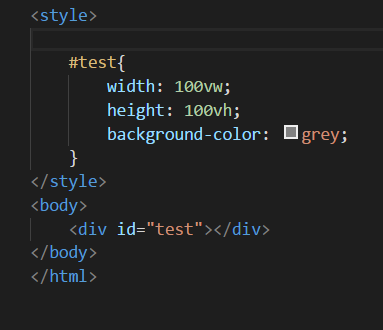

## 图片：

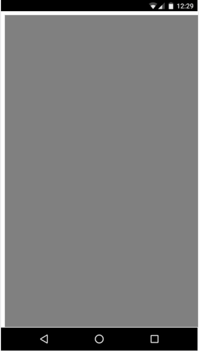

你是否也发现了问题？这遮罩层怎么没有把屏幕占满啊，原因是html和div之间有间距，只需要在所有的style之前加上

    *{padding:0;margin:0}

**2. 解决水平居中布局与滚动条跳动**

现在大多数的页面布局都是水平居中布局，我们一般是用**margin:0 auto**来做到水平居中，但是这样做有问题，一是一些信息流页面，可能开始没有滚动条，但随着渲染时间增加渲染内容会增多，由margin控制的主体元素会产生偏移；二是一些如“加载更多内容”的交互会让滚动条出现，页面向左侧移动；三则是由首页导航栏控制的几个页面，如果有点有滚动条，有的没有滚动条在切换的时候就会产生屏幕跳动的感觉。

vw可以解决这个问题，代码如下:

    html {
            overflow-y: scroll;
    }

    :root {
            overflow-y: auto;
            overflow-x: hidden;
    }

    :root body {
            position: absolute;
    }

    body {
            width: 100vw;
            overflow: hidden;
    }

简单解读：
  
先给html文档设置：当高度超出浏览器高度的时候出现滚动条，再通过:root选择器(  :root===html)设置HTML元素的属性，设置：当高度溢出的时候出现滚动条，宽度溢出的时候隐藏滚动条,再让body绝对定位并且高度为整个浏览器可视区，溢出则隐藏。隐藏左右滚动条是为了适应移动端浏览器向下滑动的交互惯性，body绝对定位并且宽度为整个可视区是为了即使宽度超出也不会出现页面向左跳动的情况。

效果：

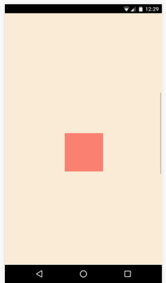

**3. 响应式文字**

当文字大小用百分比设置时,文字大小不能随屏幕变化，但vh,vm却可以做到。

## 代码：

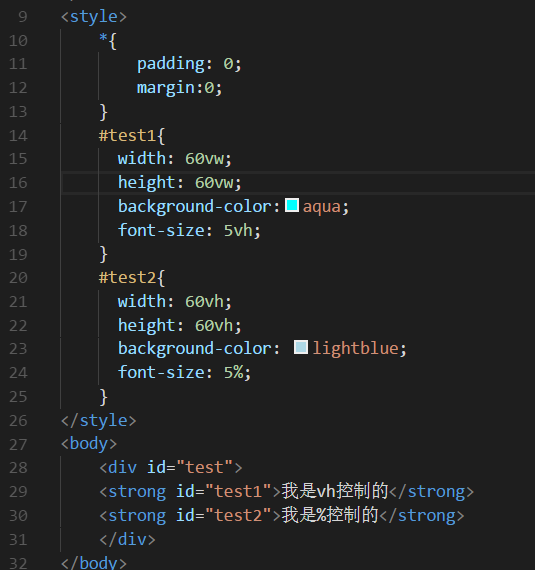

## 效果:
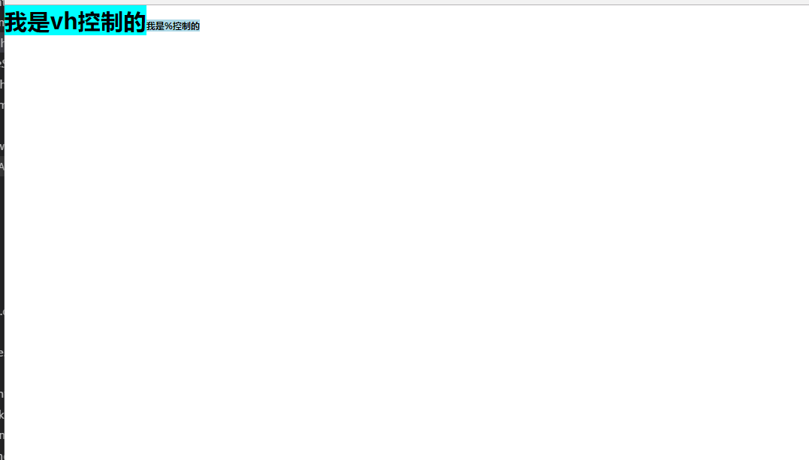
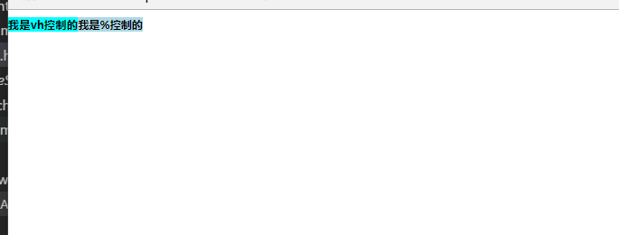

可以看到当浏览器宽度改变时，百分比中的文字宽度没有发生变化，而统一使用vw做单位的Demo中文字的大小按缩放比例发生了变化，这正是我们想要的“像图片一样布局”的效果。这时我们称它为流体字号，英文称Fluid Typography

**4. 实现容器高度随宽度等比例变化**

很多时候为了保证页面的图片不失真，我们需要图片可以做到等比例缩放。这时我们可以将父容器的宽度和高度定义为相同的vmin，这样父容器的高度和宽度就是相同值，这个时候，子容器的宽高值设为百分比，不管父容器大小如何变，子容器的高度和宽度比都是不会变的

## 代码：

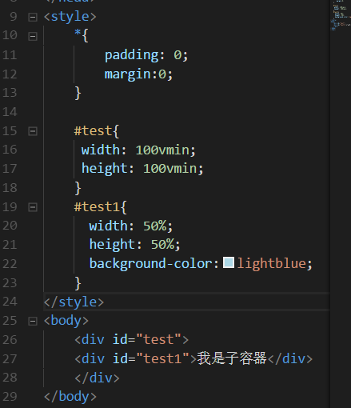

## 效果:
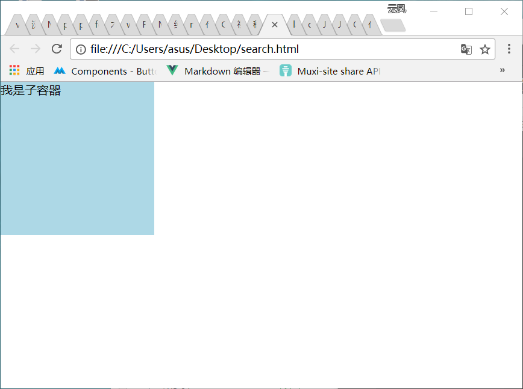
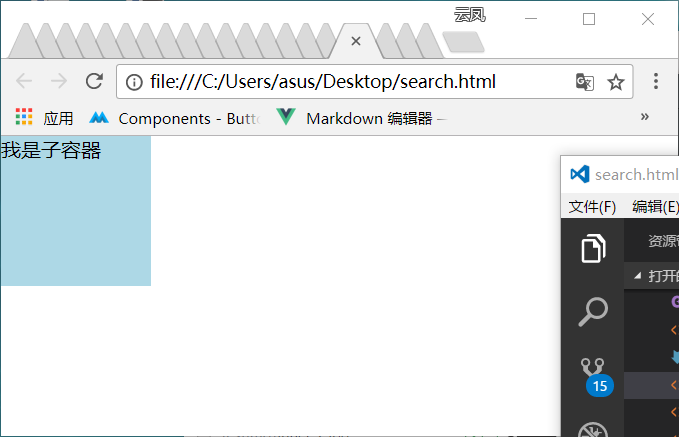

在这个例子中，父容器的宽高都是100vw即子元素百分比的根据是一样的，效果是子元素的宽高比永远是1:1。

**5. 为移动端全屏布局提供相对单位**

移动端布局的特点是因为屏幕宽度小，所以一般都是单列布局，内容纵向堆叠。一般写宽度都是100%，如果元素的宽度超过可视区宽度就会根据开发者定义的属性进行换行或者隐藏，通常情况下X轴上不会出现滚动条。但如果我们想让高度也随着屏幕宽度的百分比来计算是不行的（虽然使用按宽度计算的padding top可以hack），所以之前移动端是使用rem布局，用JS脚本动态调整rem的参照值，也就是html元素的fontsize。现在vh和vw的出现可以让我们直接参照这个按viewport宽度计算的相对单位，使用vh和vw可以更容易实现移动端的全屏布局。

比如：用vw,vh实现一个在任何屏幕尺寸下都能垂直居中的元素。

## 代码：
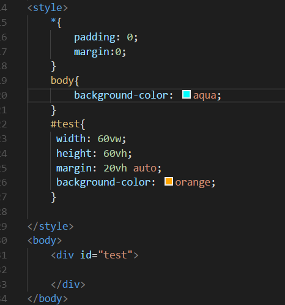

## 效果：
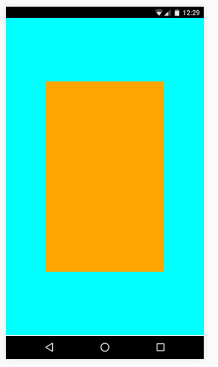
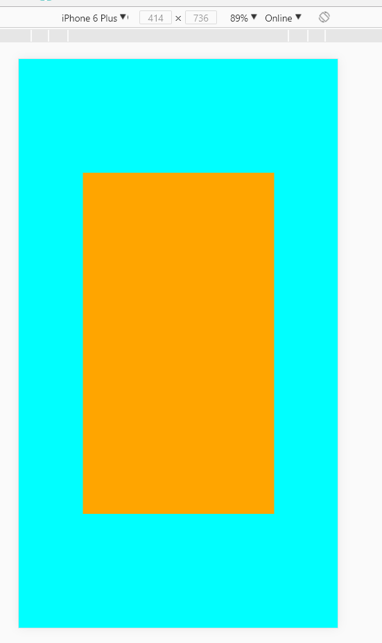

## 总结：

就兼容性而言，vh,vw,vmin在目前大多数浏览器中已经实现，而vmax实现的浏览器则更少一些（如IE至今没实现），而且能实现它的浏览器的版本也需要比其它的更新，所以在用vmax的时候要格外注意。就使用场景来说，当涉及到需要固定的比例或者与浏览器可视区相关的尺寸时，vh,vw就有更强的方便性和可用性。就与rem相比,rem 在封装组件时会和html字体耦合使用，而vh和vw就能完全地解耦；在使用rem之前，可能还需要内嵌一段脚本去动态计算根元素大小，而vh和vw就不需要那么麻烦。所以在不考虑兼容性的情况下使用vh,vw是很好的选择。但是如果顾及全方面，则还需要观察以后兼容性的发展；更何况这两者并不是完全对立的，我们可以将它们结合起来以实现页面完美布局。谢谢阅读。2017/10/1。

